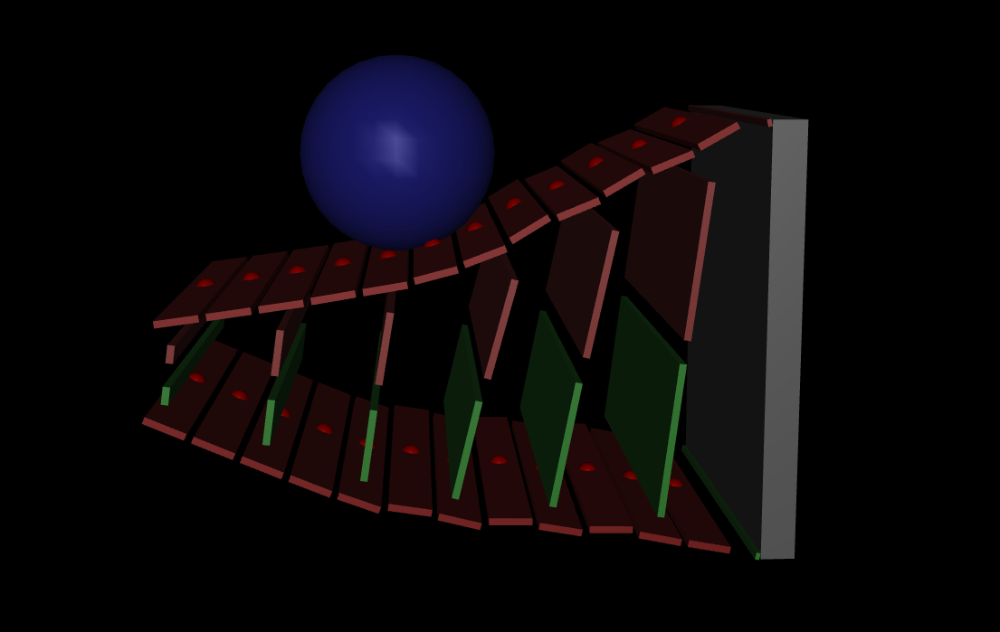

# MuJoCo Simulator for Belt-Augmented Compliant Hand (Yilin Cai, Shenli Yuan 2023)
### This repository tracks the research progress of an attempt to computationally simulate the BACH manipulator.
#### Student: Louis Abbott
#### Research Mentor: Podshara Chanrungmaneekul
#### Lab: RobotΠ Lab, directed by Dr. Kaiyu Hang

## Overview
A simplified version of the BACH's kinematic tree was imported directly from OnShape, via OnShape-to-robot (https://onshape-to-robot.readthedocs.io/en/latest/index.html). It's worth noting for future use that the mates must be made in the outermost level of the assembly tree in order for this program to work. The resulting URDF was converted to MJCF, an XML langauge native to MuJoCo. So far the challenges this research has confronted are 1) making the finger backbone flex stably in simulation and according to the BACH's expected mechanical behavior, and 2) Reliably actuating a belt to spin around an object.

## Toward Flexible Finger
This section contains work on building a flexible model of the finger backbone part using MuJoCo's flexcomp element. There are mulitple attempts to induce different behavior by scaling the robot up and down, as well as many different generated mesh models of the finger. Crucially, these tetrahedral mesh models were created using GMSH, the free meshing software. For best results, GMSH imports STEP geometry, meshes it, saves it as a surface and a volume in one file. MuJoCo only accepts MSH files with one (volume) entity, so this useful coverter removes extraneous data: https://github.com/mohammad200h/GMSHConverter/tree/tree.

In my experience, there are a few parameters that may determine the success of simulating a flexcomp with many verticies and edges, using the mujoco.elasticity.solid. The simulation timestep should be at most 0.001. The solver should be "CG," and the integrator "implicit fast." Flexcomp attributes should have selfcollide="none" and probably internal="false". Edge attributes should include equality="true" if possible. The young and poisson parameters are obviously model-dependent, but I believe it is easier to simulate flexible objects with lower poisson ratios and lower young moduli.

The efforts to obtain a stable simulation using GMSH and the flexcomp element were, unfortunately, largely unsuccessful. Even my most promising parameter combinations and simplified models would cause the simulation to diverge. Perhaps it is worth exploring this area more, but it may be that MuJoCo's method for simulating flexbles is not robust enough for this project.

### Success
More recent efforts have involved building the finger's fin ray structure from scratch, using MuJoCo's built-in block geometries, joints, and actuators for spring-damper feedback. finger_gen.py builds an xml tree to this end that is tunable with custom parameters. The results are so far more promising than those of previous methods, and the fin ray finger's behavior is manipulated more easily. However, the equality contraints required to enforce kinematic loops are hard to tune, and some components move in unpredictable ways.

Fin ray structures can indeed be modelled more analytically: https://www.frontiersin.org/journals/robotics-and-ai/articles/10.3389/frobt.2020.590076/full. In the future, it may be worth leveraging derived polynomial relationships between the fin ray finger's joints to avoid computing real-time behavior innacurrately at a low level.

## Toward Belt Simulation
This section contains work on building a model of the belts that can be actuated cleanly and reliably. So far, I have found success using MuJoCo's composite element to create a chain of links. It seems like the elasticity plugin does not suit our needs, however, and a combination of prismatic and revolute joints at each junction provides more desireable behavior. MuJoCo has no macros for this, so iterating the belt will be a challenge without a systematic way to generate the desired joints and links. The plan is to have a actuator placed on every link, pushing it along tangetially. So far this method has shown promise, but should it prove inadequate, I will try using small rollers on the finger's surface instead.
